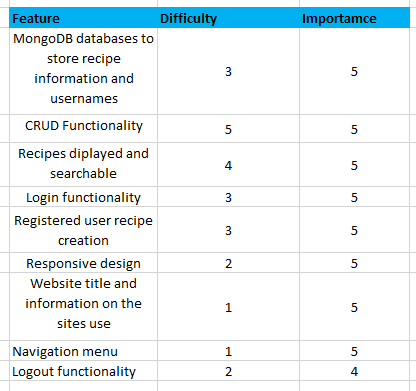
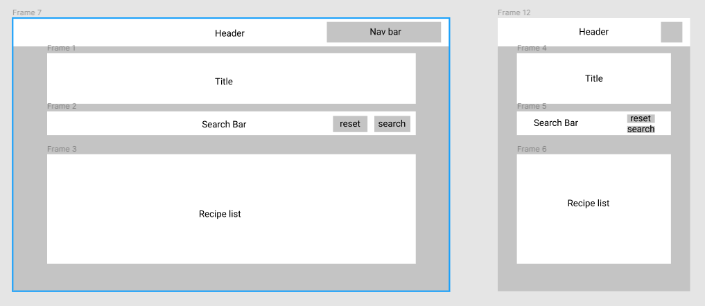
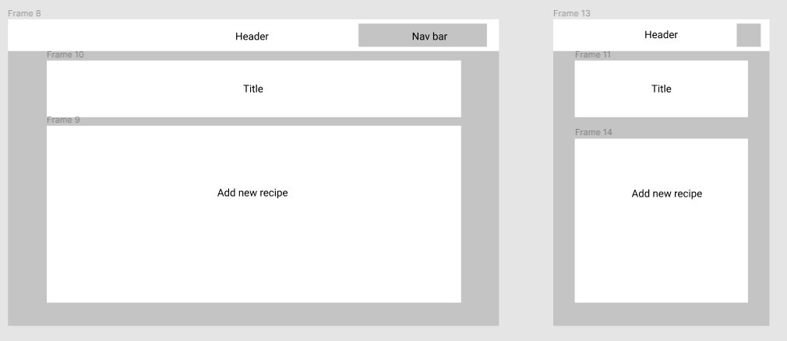
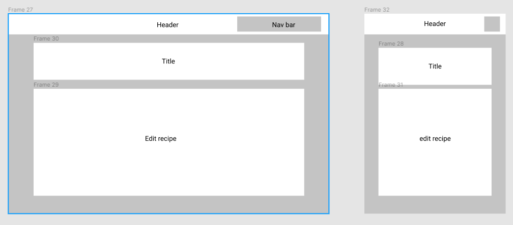
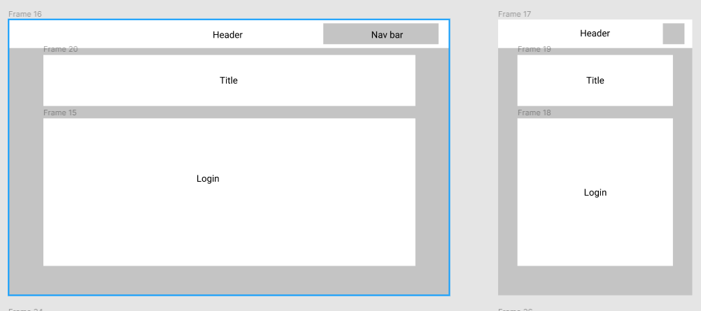
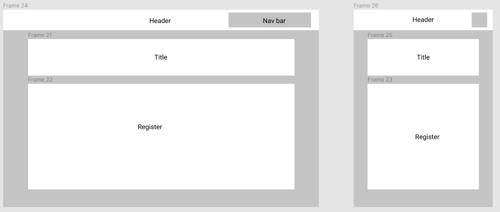
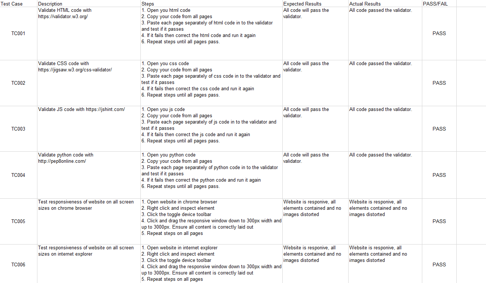
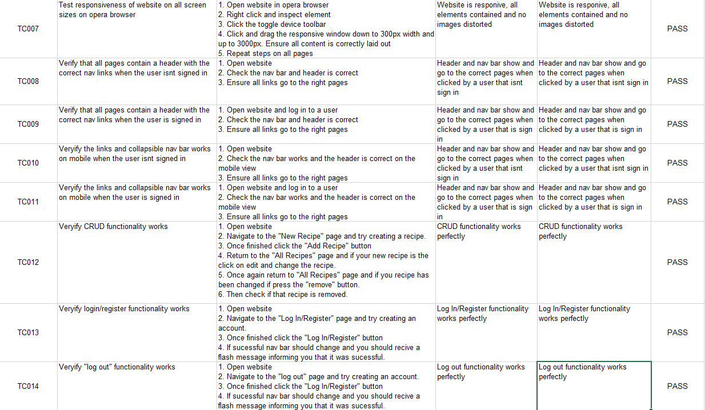

# Recipe Swap
The Recipe Swap app allows the operator to save and easily access their favourite recipes. It includes instructions on how to prepare and cook a variety of different meals all in one place. It is a place the  users can create and view their daily menus. The homepage also provides suggestions for sweet or savoury dishes that the user might be interested in, preempting the need for the user to search for an enticing dish. The user also has the option to upload their own recipes for other users to browse. The website offers the user a storage facility for quick access to their favourite recipes.
Recipe Swap. The live Website can be found [here](https://xxxxxx

## Table of Contents
* [User Experience Design (UX)](#User-Experience-Design)
    * [The Strategy Plane](#The-Strategy-Plane)
        * [Site Goals](#Site-Goals)
        * [User stories](#User-Stories)
    * [The Scope Plane](#The-Scope-Plane)
    * [The Structure Plane](#The-Structure-Plane)
    * [The Skeleton Plane](#The-Skeleton-Plane)
        * [Wireframes](#Wireframes)
        * [Database Design](#Database-Design)
        * [Security](#Security)
    * [The Surface Plane](#The-Surface-Plane)
        * [Design](#Design)
            * [Colour Scheme](#Colour-Scheme)
            * [Typography](#Typography)
            * [Imagery](#Imagery)
    * [Differences to Design](#Differences-to-Design)
- [Features](#Features)
    * [Existing Features](#Existing-Features)
    * [Future Features](#Features-Left-to-Implement)
* [Technologies](#Technologies)
* [Testing](#Testing)
    * [Test Strategy](#Test-Strategy)
    * [Test Results](#Test-Results)
    * [Isses and Resolutions](#Issues-and-Resolutions-to-issues-found-during-testing)
* [Deployment](#Deployment)
    * [Project Creation](#Project-Creation)
    * [GitHub Pages](#Deployment-To-Heroku)
    * [Run Locally](#Run-Locally)
    * [Fork Project](#Fork-Project)
* [Credits](#Credits)
  * [Content](#Content)
  * [Acknowledgements](#Acknowledgements)

****

## User Experience Design
### **The Strategy Plane**
Recipe Swap provides access to a range of simple, nutritious meals, cooking time is included so that you can choose a recipe based on the time that you have available. Recipe Swap categorises recipes by meal type so you can whip up a yummy main or scrumptious dessert. Find user's personal favourites with tailored dietary restrictions. There is a recipe for every occasion.

Recipe Swap allows the user access a number of recipes with ingredients clearly listed for use as a shopping list when you're trying to fly around the supermarket. This and the method for cooking are all available at the swipe of a finger.

This website was created for people who like to easily access and reproduce their favourite meals. The user can also capture the ingredients of a meal when eating out and recreate recipes to share with your friends and family online.

#### Site Goals
* To upload, save and share your favourite meals with other users. 
* To quickly search a range of recipes uploaded by other users.
* To enable users personalise their recipes as much as they like by including their favourite brand to use when making the recipe or encouraging other users to shop with their local butcher/veg shop.
* To provide a platform for Food/Drink Businesses. They can make the most of this website by uploading recipes that include their products and encouraging their suppliers to get involved by promoting a weekly special offer with an equivalent recipe, etc. 
* To be easy to use and accessible for people from a range of backgrounds.

#### User stories
* As a user, I want the main purpose of the site to be immediately evident when I enter the site so that I understand its aim from the offset.
* As a user I want to easily navigate the site so that I can find content quickly.
* As a user, I want the website to be responsive so that I can clearly view the webpages from my mobile device, tablet or desktop.
* As a user, I want to be able to register to the website so that I can create and manage my own  cookbook.
* As a user, I want to be able to save my favourite recipe so that I can return and access it again.
* As a user, I want to be able to return to previous recipes that I have uploaded and edit them.
* As a user, I want to be able to search recipes based on custom criteria, for example, if I need to find a vegan meal, etc.
* As a user, I want to be able to return to the main site without having to use the browser button.

### **The Scope Plane**
**Features planned:**
* Responsive design.
* Website title and information on the site purpose.
* Navigation Menu (Site Wide).
* MongoDB databases to store recipe details and user login/profile information.
* CRUD Functionality
* Login functionality.
* Logout functionality.
* Recipes displayed and searchable to all users.
* Registered user recipe creation and management.

### **The Structure Plane**

User Story:
> As a user, I want the main purpose of the site to be immediately evident when I enter the site so that I understand its aim from the offset.
Acceptance Criteria:
* Site Logo to be displayed on the main navigation bar on all pages.
* Home Page to display Website Title and information to the user on the purpose of the site.
Implementation:
* A site logo will be displayed on the main navigation menu. This should be 
displayed on all webpages.
* A search bar titled 'All Recipes' is immediately obvious on the homepage, ensuring the user is aware they have the ability to search for existing recipes.

User Story:
> As a user I want to easily navigate the site so that I can find content quickly.
Acceptance Criteria:
* Navigation menu to be displayed on all pages.
* All navigation links redirect to the correct pages.
Implementation:
* A navigation menu will be displayed on all webpages. This will redirect users to the appropriate page when 
clicked. 
*On smaller devices, the menu will collapse into a hamburger menu to make efficient use of screen 
space. When clicked, the menu will expand out from the right side of the screen displaying all nav items.

The following navigation items will be implemented:
* Home - recipes.html
* Sign Up - register.html
* Sign In - login.html
* Add Recipe - add_recipe.html
* Edit Recipe - edit_recipe.html
* Sign Out - (redirects to login page)

User Story:
> As a user, I want the website to be responsive so that I can clearly view the webpages from my mobile device, tablet or desktop.

Acceptance Criteria:
* Content should be responsive and display clearly on all devices with no horizontal scroll.
Implementation:

Materialize will be used for website layout with suitable column sizes and containers to ensure that all content is displayed clearly on all devices.

User Story:
> As a user, I want to be able to register to the website so that I can create and manage my own  cookbook.

Acceptance Criteria:
* Sign up - Login and Logout functionality to be added.
* User must have the ability to create, update and delete their own recipes.
* Only the creator of the recipes should have the ability to update or delete their recipes.

Implementation:

* A Sign Up page will be implemented that allows users to register for an account on the website. 
*The username will be stored in a MongoDB database collection called users. In order to create and modify recipes, a user will have to register and login to the website. 
Only the creator of the recipe will have the ability to update or delete the recipe. This will prevent unwanted modification or deletion of recipes by other users. A flash message will be shown to the user to alert them whether the edit was successful.

* A Log In page will be implemented to allow registered users the ability to sign in to their account. 

* Once a user has successfully logged in, they will be able to access previously uploaded recipes and edit/remove them. They will also be able to create new recipes. A Create Recipe page will be implemented that will be accessible and visible on the navigation menu to users that are signed in. The user will be able to create a recipe from this page. The recipe information will be stored in a MongoDB database collection called recipes and the recipe categories will be stored in a MongoDB collection called categories.

* A Log Out button will be displayed to users who are logged in. When clicked this will sign the user out of the website and redirect them to the Log In page.

User Story:
> As a user, I want to be able to save my favourite recipe so that I can return and access it again.
Acceptance Criteria:
* User account functionality enables recipes that were created by user to be stored on the homepage.

Implementation:
* User can log in and out of their account to view recipes that they previously created. Recipe details are stored in MongoDB database collection called recipes and the recipe categories will be stored in a MongoDB collection called categories.

User Story:
> As a user, I want to be able to return to previous recipes that I have uploaded and edit them.

Acceptance Criteria:
* User will be able to delete and edit their recipes when logged in.

Implementation:
* When user is logged in to their account, an edit and delete button will appear on the recipes that they uploaded.

User Story:
> As a user, I want to be able to search recipes based on custom criteria, for example, if I need to find a vegan meal, etc.

Acceptance Criteria:
* Recipes must be displayed to all users regardless of user status - logged in or logged out.
* Users should be able to search for recipes by name or ingredients.

Implementation:

* A homepage will be implemented that is displayed to all users and is accessible to both logged in users or guests. 

* This page will display all available recipes in a materialize collapsible element. These recipes are collapsible and can be expanded to view details on click, this saves space on the page.

* A search box will be displayed on screen which will allow users to search for recipes based on ingredients and name. This will return a filtered, full list of recipes for the current search criteria. This will be implemented using a database index that will be created on the MongoDB collection recipes.

User Story:
> As a user, I want to be able to return to the main site without having to use the browser button.

Acceptance Criteria:
* Clicking the Logo or 'All Recipes' button on the Navigation Bar will return the User to the homepage. 

Implementation:
The logo and 'All Recipes' button will contain a clickable anchor link to allow the user to redirect to the main website without needing to use the browser navigation buttons.

### **The Skeleton Plane**
#### Wireframes

**Final Wireframes**

Home: 
 
New Recipe: 
 
Edit Recipe: 
 
Log In: 
 
Register 
 

## Database Design
MongoDB Object format examples:

**Collection: categories** 
{ 
&nbsp;&nbsp;&nbsp;&nbsp;_id: unique-value, 
&nbsp;&nbsp;&nbsp;&nbsp;course: "Starter" 
&nbsp;&nbsp;&nbsp;&nbsp;course: "Main" 
&nbsp;&nbsp;&nbsp;&nbsp;course: "Dessert" 
}

**Collection: Recipes** 
{ 
&nbsp;&nbsp;&nbsp;&nbsp;_id: unique-value, 
&nbsp;&nbsp;&nbsp;&nbsp;recipe_name: "Vegan Fruity Curry", 
&nbsp;&nbsp;&nbsp;&nbsp;ingredients : " 2 Peppers 
 2 Red Onions,
 1 Bramley Apple,
 3 Sticks of Celery,
 1 Tin of Chopped Tomatoes,
 To Make the Sauce:
 1 Tbl. Spoon Oil,
 Tbl. spoon Flour,
 Tin of Coconut Milk,
 2 Tsp of Curry Powder.", 
&nbsp;&nbsp;&nbsp;&nbsp;directions : "STEP 1
Make a roux with flour and oil - add coconut milk and curry powder for sauce.
STEP 2
Chop all of the ingredients and slowly add to a separate saucepan start with onions and peppers and lightly cook off, add celery and apple next and finally add a tin of tomatoes.
STEP 3
Allow vegetables to simmer for 15 mins before adding to the sauce.", 
&nbsp;&nbsp;&nbsp;&nbsp;dish_times : "about 45 minutes", 
&nbsp;&nbsp;&nbsp;&nbsp;is_vegan : "on" 
&nbsp;&nbsp;&nbsp;&nbsp;created_by : session[user] 
}

**Collection: users** 
{ 
&nbsp;&nbsp;&nbsp;&nbsp;_id: unique-value, 
&nbsp;&nbsp;&nbsp;&nbsp;username: "dylan", 
&nbsp;&nbsp;&nbsp;&nbsp;password: "unique-value", 
}

#### Security

Database connection details are set up in an [env.py](https://pypi.org/project/env.py/) for development, for 
security reasons this is not uploaded to GitHub so that database and connection details are not visible to 
users. In production these are stored in Heroku. 

### **The Surface Plane**
### Design

#### Colour Scheme
The main background colour is a background image for the general background with a red header on all pages of the website. 

The main website text is white, a secondary text colour of green appears throughout the website.

#### Typography
The main heading on all pages, the expanded materialize collapsible element headings and all other text throughout use the 'Times' font.

#### Imagery
A background image will be used on all pages displaying a classic Irish breakfast, this image was 
taken from Google images. 

## Features

### Existing Features

* Home page displaying recipes created by users.
* User sign up functionality.
* Sign in / Sign out functionality.
* Search engine that enables users to search for recipes using recipe names and ingredients.
* Create recipe page allowing signed in users to create recipes.
* Modification ability for signed in users on existing recipes created by them. 
* Mobile responsive design.

### Features Left to Implement

A  feature to be included in the next release will allow users to upload images of the dishes they create. These will be displayed in the materialize collapsible elements along with the event information.

Admin login will be implemented in the next release to allow admin users to delete any events that may be inappropriate.

A feature to be included in the next release is a 'Gluten Free' tag similar to the 'Vegan' tag already featured. 

Another feature that will be included in the next release will allow users to search for recipes by category (starter, main, etc) and by cooking time.

****
## Technologies
* [HTML](https://en.wikipedia.org/wiki/HTML)
	* This project uses HTML as the main language used to complete the structure of the Website.
* [CSS](https://en.wikipedia.org/wiki/CSS)
	* This project uses custom written CSS to style the Website.
* [JavaScript](https://en.wikipedia.org/wiki/JavaScript)
    * JavaScript is used along with [emailjs](https://www.emailjs.com/) for the contact form. This sends an email to the owner
    on form submit.
* [Materialize](https://materializecss.com/)
    * The Materialize framework was used through the website for layout and responsiveness.
* [Python](https://www.python.org/)
    * This projects core was created using Python, the back-end logic and the means to run/view the Website.
    * Python Modules used (These can be found in the requirements.txt project file):
        * click==8.0.1
        * dnspython==2.1.0
        * Flask==2.0.1
        * Flask-PyMongo==2.3.0
        * itsdangerous==2.0.1
        * pymongo==3.11.4
        * Werkzeug==2.0.1
* [MongoDB](https://www.mongodb.com/1)
    * MongoDB was used to create the document based databases(collections) used as data storage for this project.
* [Google Fonts](https://fonts.google.com/)
	* Google fonts are used throughout the project to import the *Inter* and *Bevan* fonts.
* [GitHub](https://github.com/)
	* GithHub is the hosting site used to store the source code for the Website.
* [Git](https://git-scm.com/)
	* Git is used as version control software to commit and push code to the GitHub repository where the source code is stored.
* [Heroku](https://dashboard.heroku.com/apps)
    * Heroku was used to deploy the live website.
* [Google Chrome Developer Tools](https://developers.google.com/web/tools/chrome-devtools)
	* Google chromes built in developer tools are used to inspect page elements and help debug issues with the site layout and test different CSS styles.
* [figma Wireframes](https://www.figma.com/)
	* This was used to create wireframes for 'The Skeleton Plane' stage of UX design.
* [Font Awesome](https://fontawesome.com/)
    * All the Icons displayed throughout the website are Font Awesome icons.
* [Favicon](https://favicon.io/)
    * Favicon.io was used to make the site favicon 
* [Techsini](http://techsini.com/multi-mockup/index.php)
    * Multi Device Website Mockup Generator was used to create the Mock up image in this README

****
## Testing

### Test Strategy
#### **Summary**
Testing is required on all features and user stories documented in this README. 
All clickable links must redirect to the correct pages. All forms linked to MongoDB
must be tested to ensure they insert all given fields into the correct collections.

HTML Code must pass through the [W3C HTML Validator](https://validator.w3.org/#validate_by_uri).

CSS Code must pass through the [W3C CSS Validator](https://jigsaw.w3.org/css-validator/).

JavaScript code must pass through the [JSHint Validator](https://jshint.com/).

Python Code must pass through [PEP8 Validator](http://pep8online.com/)
#### **High Level Test Cases**

#### **Access Requirements**
Tester must have access to MongoDB in order to manually verify the insertion 
of records to users and recipe collections.

#### **Regression Testing**
All features previously tested during development in a local environment must be regression 
tested in production on the live website.

#### **Assumptions and Dependencies**
Testing is dependent on the website being deployed live on Heroku.

****
## Deployment

### Project Creation
To create this project I used the CI Gitpod Full Template by going here 
[here](https://github.com/Code-Institute-Org/gitpod-full-template) and clicking the 'Use this template' button.

I was then directed to the 'Create New Repository From Template' page, here I input my desired repo name and clicked the 'Create Repository From Template' button.

Once created, I went to my new repository on GitHub and clicked the Gitpod button which built my workspace.

The following commands were used for version control throughout the project:

* git add *filename* - This command was used to add files to the staging area before committing.

* git commit -m "commit message explaining the updates" - This command was used to to commit changes to the local repository.

* git push - This command is used to push all committed changes to the GitHub repository.

### Deployment to Heroku

**Create application:**
1. Navigate to Heroku.com and login.
1. Click on the new button.
1. Select create new app.
1. Enter the app name.
1. Select region.

**Set up connection to Github Repository:**

1. Click the 'Deploy' tab and select GitHub and connect to GitHub.
1. You are then prompted to find a github repository to connect to.
1. Enter the repository name for the project and click search.
1. Once the repo has been found, click the connect button.

**Set environment variables:**

Click the settings tab and then click the Reveal Config Vars button and add the following:

1. key: IP, value: 0.0.0.0
2. key: PORT, value: 5000
3. key: MONGO_DBNAME, value: (database name you want to connect to)
4. key: MONGO_URI, value: (mongo uri - This can be found in MongoDB by going to clusters > connect > connect to your application and substituting the password and 
    dbname that you set up in the link).
5. key: SECRET_KEY, value: (This is a custom secret key set up for configuration to keep client-side sessions secure).

**Enable automatic deployment:**
1. Click the Deploy tab
1. In the Automatic Deploys section, choose the branch you want to deploy from and then click Enable Automation Deploys.

### Run Locally

**Note: The project will not run locally with database connections unless the user sets up an [env.py](https://pypi.org/project/env.py/) file configuring IP, PORT, 
MONGO_URI, MONGO_DBNAME and SECRET_KEY. You must have the connection details in order to do this. These details are private and not disclosed in this repository 
for security purposes.**

1. Navigate to the GitHub [Repository](https://github.com/dylanocallaghan/M-S-3).
1. Click the Code drop down menu.
1. Here, you can either download the ZIP file, unpackage locally and open with IDE (This route ends here) OR Copy Git URL from the HTTPS dialogue box.
1. Open your development editor of choice, also open a terminal window in a directory of your choice.
1. Use the 'git clone' command in terminal followed by the copied git URL.
1. A clone of the project will be created locally on your machine.

Once the project has been loaded into an IDE of choice, run the following command in the shell to install all the required packages:
> pip install -r requirements.txt

****
## Credits

Background image - Taken from (https://money.yahoo.com/best-traditional-irish-food-st-210000643.html?guccounter=1&guce_referrer=aHR0cHM6Ly93d3cuZ29vZ2xlLmNvbS8&guce_referrer_sig=AQAAAIrM8eOnb7b09prBE_p6ZMu8Jsg5Gf-OF7pCZgAADbByEIhOxxOfBdirdL3OL1MZdnHMzLIfAExrOi3KxAuCsA-z86sYuAVw0vp_U2wIunlQHk9-tCv3OS4TFGyHgsujGnK2ZJhzQ9PBB5NbCvMrTWksBn0KC086WrIfu4YMIQsB) 

### Code

[Code institute](https://learn.codeinstitute.net/ci_program/diplomainsoftwaredevelopment) - The code used to create the website back-end functions was derived from previous projects created for the Software Development course with The Code Institute.

[Materialize](https://materializecss.com/) - Materialize was used to make the nav bar and header for the website.

JavaScript Validation function in scripts.js was code from course material for Task Manager App. 

### Acknowledgements

I'd like to give special thanks to the the following people for their help with my project:
* Helpful slack users who responded to any queries that I had throughout the project e.g. issues implementing the collapsible menu from materialize.
* My mentor Spencer for reviewing my project and confirming he was happy with my work.

****
